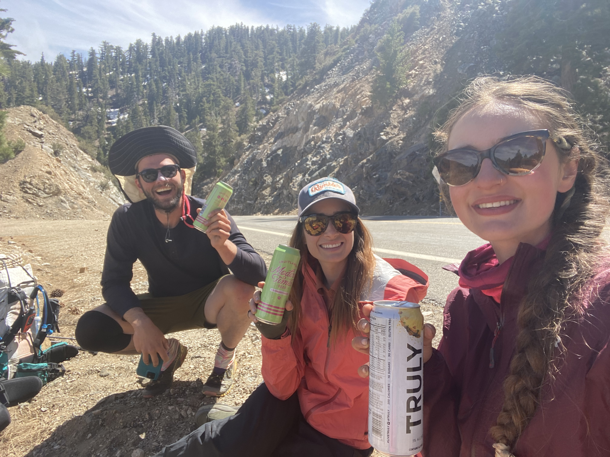
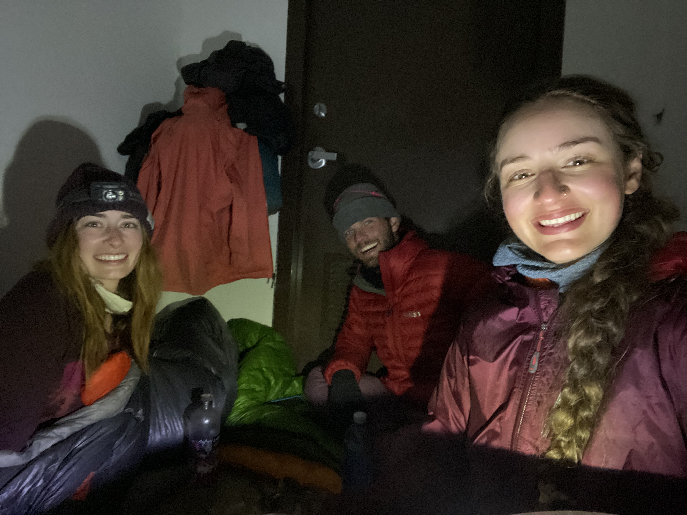

Started the day in town, hanging out and finishing up chores didn’t start trail until around noon lol our group is going for that speed record!! 

We had 20 miles of road walking in front of us cause the trail was closed due to a old fire. The first bit wasn’t bad but when we got a few miles in and cars started driving by at the speed limit I started to re live my accident back in September. Also every car that came the opposite direction we were walking I saw my self in my minds eye getting hit by them. It was real exhausting. Lotta calming breaths thanks yoga on high and my old boss Kate👩‍🦰 for showing me how powerful breathing can be!!

When we decided to stop for the day I was mentally exhausted but ramblin and sand Witch were able to bring me back. Second time they’ve saved me from a pit of depression. I could not have done that section without them no way no how.

Soooooooo finally we were at a trailhead parking lot the woods around us scorched ( making it not safe to camp in cause of trees and branches falling from the SKY) there was a storm coming in and it was getting cold. We made the tough decision to sleep in a pit toilet. God it was warm in there.

The three of us slept in one of the toilets and used the other one to store our gear, space was limited. That worked until a car came up around ten PM then we all froze. Are they going to us the restroom?? Are they going to see our things?? Why didn’t we stack out things on top of the toilet. Free space!!! We sat there for a while after hearing the car pull up arguing about what to do. I wanted to just go outside and see what was up, if they were gone I’d get out stuff and bring it in then go to bed. They wanted to keep the door shut and hope nothing happened, they were worried about being murdered. Apparently that’s a thing women think about that my male privilege protects me from. Eventually I opened the door, the car was gone and I consolidated our things. I let out a triumphant told you so that I wish I wouldn’t have done but of well.

That was the day yeeeeesh it was long

Totd: means thing of the day not sure I mentioned that before abbreviating it: people on trail are starting to read these posts, I wonder if that changes what I write? Yes it definitely does. I think i don’t say the sub par interactions I have out here cause of it more than that? Maybe probably yes too idk k 

