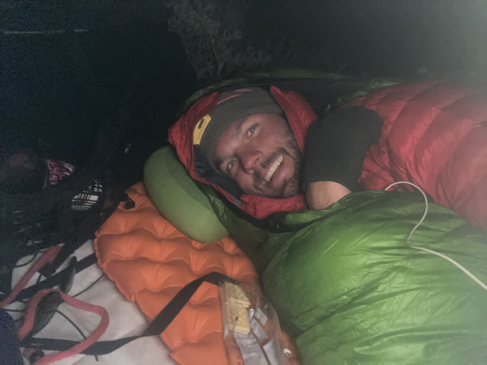

Started the day at a birthday party? Where am I lolololol. It was funfacts birthday so magicmarker got a cake with his picture and a whole buffet from Cracker Barrel!!! She’s an amazing person!! Most people out here are 👻

We started hiking pretty late and took a few breaks in the beginning. I needed to get to town by 4ish so I started hustling up the hill/mountain I did about 20 miles. Felt really good to push it up hill. Uphill for the win fuck down hill.

Night hiked for the first time out here was beautiful 😻 got to camp around 9ish found a spot out of the wind FUW (Fuck you wind) heard the wind ripping around the mountain but barely felt it!!! Wooo go choosing a good spot

\
Totd moon lit shadows are trippy 

