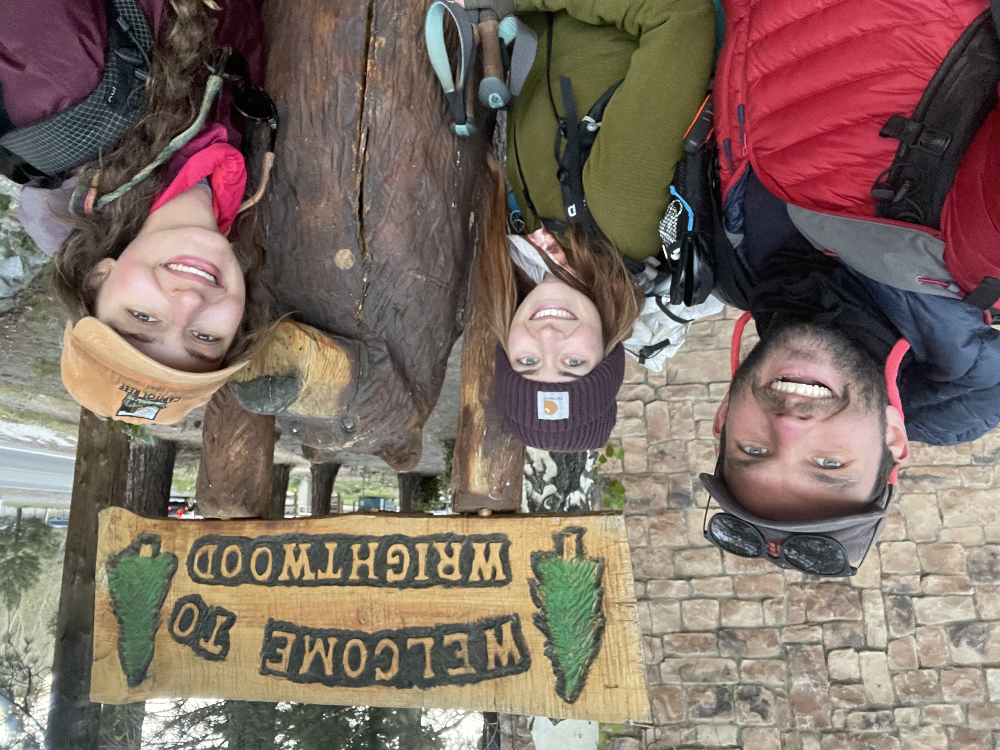

Woke up in a cabin was glorious. Moved to a “Bud” farm.... I think they grow friendships or something (not my joke but I’m stealing it). We moved our things out of a quaint cabin into someone’s front yard, we moving down in the world how much lower could we get???? (Foreshadowing cause I’m writing this one day later) we left most of our things at the farm and slack packed ( it’s when you hike with minimal things like day hikers) I flew up to Biden Powell peak. Was a lot of fun to go as fast as I can up a mountain. Went 3.5 ish miles and 3,000 feet up in just under 1.5 hours 🤗 was beautiful up there! Went to dinner thought about what I want from this trip a lot for the rest of the night. Who do I want to be after it? I think I want to be realer? Show how I’m truly feeling not just smile and wave all the time. Idk I’ve got a few more months to think about it, I’ll think About it more next week

Got back to the farm and hung around a fire till midnight. Real midnight not hiker midnight which is when the sun goes down. When a donkey and a four year old child come out of no where!?!!!? Feed the donkey talked with the kid went to bed. Friendships were grown on the bud farm

Was a very introspective night and now looking back on it it’s nice that not once did I ask “what am I doing???” Reassuring that the pct is what I should be doing

\
Thing of the day: When asked about my aura someone said which aura? The one he projects to the world or the one he actually is inside? How does this guy I’ve known for a few weeks see that far inside me? Wild dinner

