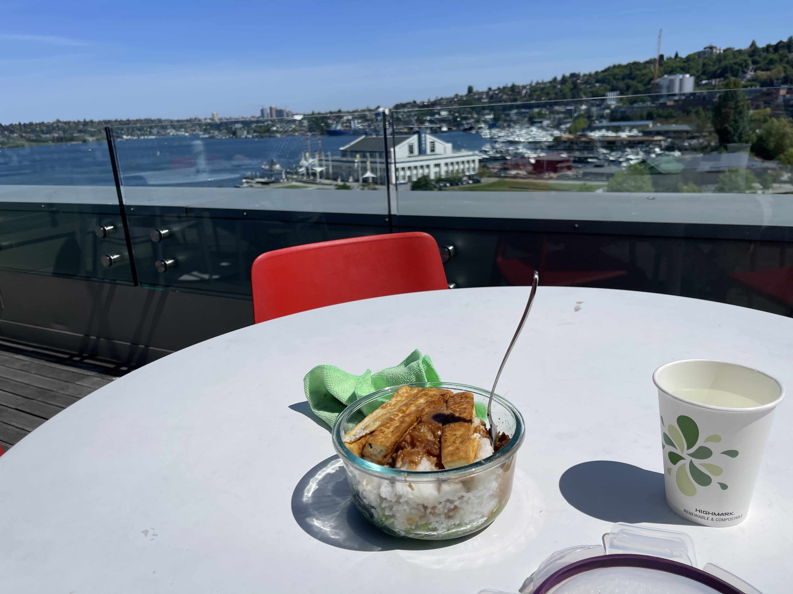

Woke up earlier this week to a spider on my face!! It was a way to wake up. I’m getting less and less scared of them so that’s nice

it was a calm week I had enough time to do all the things I wanted and watch most of an episode of better call Saul 10/10 would recommend 

cried in therapy it was nice. 

the weather is so nice out here!!! See attached photo. my climbing class has plans to climb lundin peak near snoqualamie pass tomorrow. But it’s been unusually warm so avalanches are doing their avalanch thing. We might have to do something else. They also keep adding things to our gear list, that makes me think our plans have changed. But they want us to plan how to climb lundin so they haven’t told us idk. 

our last class was taught by a SAR helicopter person and a NWAC avalanche forecaster!!! WHOA it was awesome learning from them!! also I think I’ve heard of the SAR guy from my sar trainings

