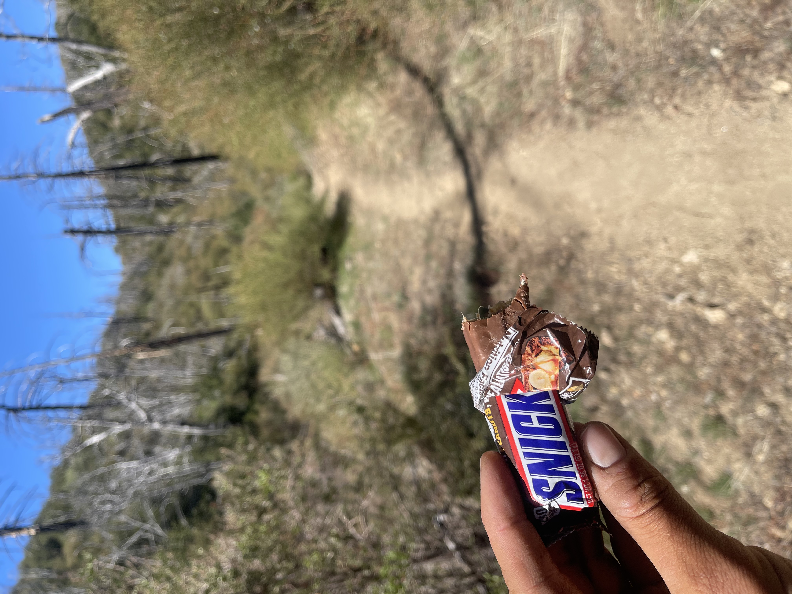

Walked. Had phone service part of the day got to call my parents was nice 🧸 ( talk about my emoji choices way too much I gotta keep them on point, will actually thinking about them now instead of randomly choosing the first one I think fits change that? Oh Jerez! ) slept at a ranger station and hung out till after dark. Was nice to hang out with my trail fam 🎉

Totd: walked under some high voltage power lines today while I had both head phones in (it’s good if there’s a rattle snake near so I don’t hear it coming) heard some snapping and cracking thought my head phones were exploding. Was weird, took a video

Totd2: got a snickers from some day hiker trail angles today. I haven’t eaten a snickers in years, the taste reminded me of Halloween as a kid 👦 thanks mom and dad for giving me these happy memories I love you both 🫀

